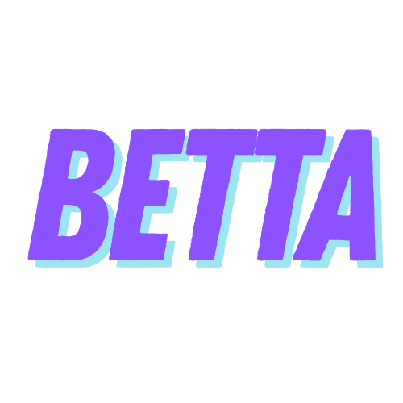

# betta

[](https://github.com/siegstedt/betta/actions/workflows/ci.yml)
[](https://opensource.org/licenses/MIT)



*get betta. get better.*

`betta` is a comprehensive, open-source training and performance analysis platform for data-driven cyclists and coaches. Built with a state-of-the-art technology stack, it provides the tools to upload, analyze, plan, and adapt training to achieve peak performance.

## Table of Contents

1. [Core Features](#core-features)
2. [Application Structure](#application-structure)
3. [Tech Stack](#tech-stack)
4. [Getting Started](#getting-started)
5. [Project Roadmap](#project-roadmap)
6. [Contributing](#contributing)

-----

## 🎯 Core Features

* **Deep `.fit` File Analysis:** Upload activities directly from a bike computer and get detailed second-by-second data analysis.
* **Performance Management:** Automatically track long-term fitness (CTL), fatigue (ATL), and form (TSB) with a Performance Management Chart (PMC).
* **Training Planning & Calendar:** Plan future workouts, track compliance, and visualize your entire season at a glance.
* **Virtual Power:** Estimate power output for athletes without a power meter using supported indoor trainers (e.g., Tacx Blue Motion).
* **Goal Setting & Event Tracking:** Set performance goals (e.g., FTP, W/kg) and prioritize key races for the season.
* **Adaptive Intelligence (Future):** Get smart suggestions to adjust your training plan based on fatigue and performance.

-----

## 🏛️ Application Structure

The application is designed around a coach-centric, multi-athlete architecture, but it works perfectly for a single user as well.

* **Coach Dashboard / Athlete Roster**
  * A grid of "Athlete Tiles" showing at-a-glance CTL, ATL, and TSB for every athlete.
* **Athlete's World (Main Hub)**
  * This is the main view after selecting an athlete, with a persistent sidebar for navigation.
  * **👤 Athlete Profile:** Manage personal info, historical weight, and FTP/THR values.
  * **📅 Training Calendar:** The central hub for viewing planned workouts and completed activities.
  * **🎯 Goals & Events:** A dashboard for setting race priorities and performance targets.
  * **📈 Performance Analysis:** The deep-dive section for historical data analysis.
    * Performance Management Chart (PMC)
    * Mean Maximal Power (MMP) Curve
    * FTP Progression & Weight Trend Charts
  * **🚴 Activity Log:** A chronological list of all completed activities.
* **Single Activity View**
  * The detailed analysis page for a single ride, including summary stats, an interactive map, performance charts, lap data, and power zone analysis.

-----

## 🛠️ Tech Stack

This project uses a modern, high-performance, and easily distributable tech stack.

### Frontend

* **Framework:** **Next.js (React)** for a fast, modern, and component-based user interface.
* **Styling:** **Tailwind CSS** for rapid, utility-first UI development.
* **Visualization:** **Recharts** for building beautiful and interactive performance charts.

### Backend

* **Framework:** **FastAPI (Python)** for a high-performance, asynchronous API with automatic documentation.
* **Database ORM:** **SQLAlchemy 2.0** for powerful and modern database communication.
* **File Processing:** **`fitparse-python`** for robust parsing of `.fit` files.

### Infrastructure

* **Database:** **PostgreSQL** enhanced with the **TimescaleDB** extension for hyper-efficient time-series data handling.
* **Containerization:** **Docker & Docker Compose** to package the entire application stack for easy, one-command setup and deployment.

-----

## 🚀 Getting Started

You can get a full local development environment running with a single command.

### Prerequisites

* [Git](https://git-scm.com/)
* [Docker Desktop](https://www.docker.com/products/docker-desktop/)

### Installation & Setup

1. **Clone the repository:**

    ```bash
    git clone https://github.com/siegstedt/betta.git
    ```

2. **Navigate to the project directory:**

    ```bash
    cd betta
    ```

3. **Configure environment variables (optional):**

    For local development, copy the example environment file:

    ```bash
    cp frontend/.env.example frontend/.env.local
    ```

    The default configuration should work for Docker development. For custom setups, edit `frontend/.env.local` with your API URL.

4. **Build and run the containers:**

    ```bash
    docker compose up --build
    ```

    This will start the frontend, backend, and database services.

### Accessing the Application

* **Frontend Application:** [http://localhost:3000]
* **Backend API Docs (Swagger UI):** [http://localhost:8000/docs]

### Environment Configuration

The application uses environment variables for configuration:

- **Frontend**: `NEXT_PUBLIC_API_URL` - URL of the backend API
  - Development (Docker): `http://backend:8000`
  - Development (local): `http://localhost:8000`
  - Production: Your deployed backend URL

Environment files:
- `.env.example`: Template with all required variables
- `.env.local`: Local development overrides (not committed to git)

For production deployment, set the appropriate environment variables in your hosting platform.

-----

## 🗺️ Project Roadmap

* **Phase 1: The Core Analysis Engine (MVP)**

  * Focus on the `Athlete Profile`, `Single Activity View`, and `Activity Log`. The main goal is to upload a `.fit` file and get a world-class analysis of that single ride.

* **Phase 2: Longitudinal Performance Tracking**

  * Implement the `Performance Analysis` page, including the PMC, historical MMP curve, and FTP/weight progression charts.

* **Phase 3: Planning, Coaching, and Goals**

  * Build the `Coach Dashboard`, interactive `Training Calendar`, and the `Goals & Events` page. This phase introduces future planning.

* **Phase 4: Intelligence and Refinement**

  * Develop the "Adaptive Planning" algorithm and UI. Introduce a notification system and focus on performance optimization.

-----

## 🙌 Contributing

This is an open-source project. Contributions are welcome\! Please fork the repository and submit a pull request with your proposed changes. Ensure that your code follows the existing style and includes relevant tests.

